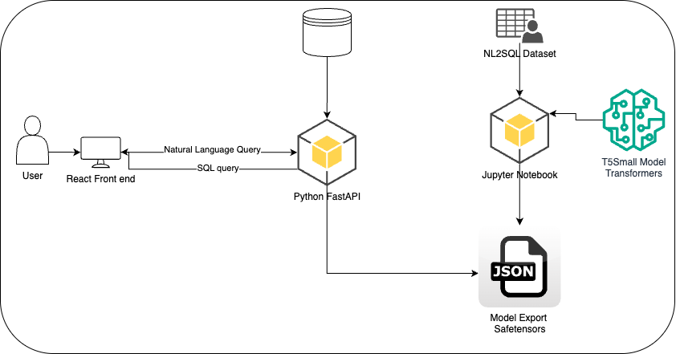

<h1>NL2SQL Translation System</h1>

End-to-end solution for converting natural language queries to SQL using React frontend and Python backend
<h3>Demo on YouTube</h3>
https://youtu.be/ePS7UmnFpZI
 
<h3>Repository Structure</h3>
This repository contains 3 folders, front-end, back-end and model_training 
Folder front-end contains code for React Web UI, along with Redux, Saga and Slices implementation. 
Folder back-end contains code for Python FastAPI code, which is used for APIs which are used for query processing. 
Folder model_training contains all the data used for training the model to predict SQL queries. It contains .ipynb files, dataset csv and resultant model export jsons and tesnors. 
Current stable version of explorted model is inside folder sql_generator-nl2sql, which is generated with help of NL2SQL_Cleaned.csv and model_training-nl2sql.ipynb 

<h3>Architecture of the project.</h3>

<h3>Key Features</h3>
1. Natural language understanding with schema linking 
2. Dynamic few-shot learning implementation 
3. React-based query interface 

Report for this project is available as Project Report.pdf in base directory. 

<h3>Installation</h3>
1. Clone repo 
2. Install dependencies: 
    Install React App dependencies 
    1) cd front-end/nl2sql 
    2) npm install   
    Install Python FastAPI dependency and Model use requirements 
    1)cd back-end   
    2) pip install -r requirements.txt   

<h3>Usage</h3>
Start backend API using following commands 
1. cd back-end 
2. uvicorn main:app --reload 
Now, the backend is loaded onto http://localhost:8000. You can view the API documentaion at http://localhost:8000/docs 

Launch React app using following commands 
1. cd front-end/nl2sql 
2. npm start 
This will start the front end server on your local at http://localhost:3000 

- Input natural language query 
- View generated SQL and results 

<h3>Model Training</h3>
All the code for training of T5small model is present inside the folder model_training. 
The code used for the current active version of trained model is inside model_training-nl2sql.ipynb file. This file uses NL2SQL_Cleaned.csv as input source. The output of this training is saved inside sql_generator-nl2sql folder which is again saved in back-end directory for using into API. 
